# CCTV Manual - All Diagrams

This file contains all diagrams for the CCTV Installation Training Manual.
Diagrams are created in Mermaid syntax (for flowcharts/network diagrams) and ASCII art.

---

## How to Use These Diagrams

### Mermaid Diagrams
1. Copy the code between ` ```mermaid ` and ` ``` `
2. Go to https://mermaid.live/
3. Paste the code
4. Export as PNG/SVG
5. Save to `images/` folder with descriptive filename
6. Replace `[Diagram: ...]` placeholder in manual with ``

### ASCII Art Diagrams
1. These are text-based diagrams already visible in the manual
2. They render in code blocks
3. No conversion needed

---

# CHAPTER 4 - NETWORKING FUNDAMENTALS

---

## Diagram 1: LAN Network Layout for CCTV

```mermaid
graph TB
    subgraph "Internet Cloud"
        ISP[ISP Router]
    end
    
    subgraph "Office / Building"
        Router[Router<br/>192.168.1.1]
        Switch[PoE Switch<br/>192.168.1.2]
        
        subgraph "Cameras"
            CAM1[Dome Camera<br/>192.168.1.10]
            CAM2[Bullet Camera<br/>192.168.1.11]
            CAM3[PTZ Camera<br/>192.168.1.12]
            CAM4[Dome Camera<br/>192.168.1.13]
        end
        
        DVR[DVR/NVR<br/>192.168.1.100]
        MON[Monitor]
        PC[Management PC<br/>192.168.1.50]
    end
    
    ISP -->|WAN| Router
    Router -->|LAN| Switch
    Switch --> CAM1
    Switch --> CAM2
    Switch --> CAM3
    Switch --> CAM4
    Switch --> DVR
    DVR --> MON
    Switch --> PC
    
    style Router fill:#4CAF50,color:#fff
    Switch fill:#2196F3,color:#fff
    DVR fill:#f44336,color:#fff
    CAM1 fill:#FF9800,color:#fff
    CAM2 fill:#FF9800,color:#fff
    CAM3 fill:#FF9800,color:#fff
    CAM4 fill:#FF9800,color:#fff
```

---

## Diagram 2: LAN vs WAN Architecture

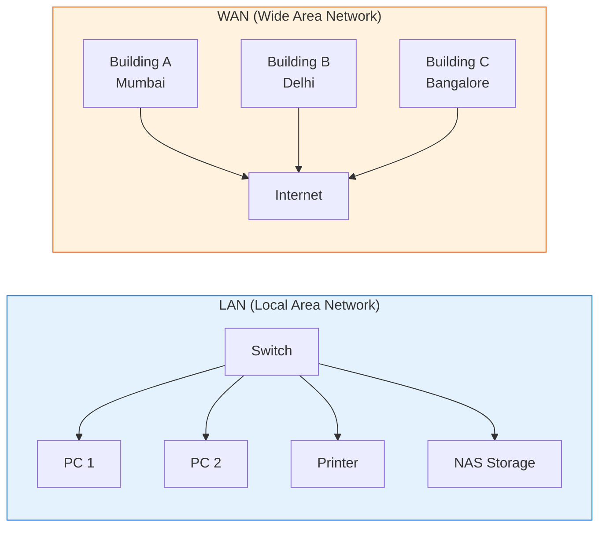

---

## Diagram 3: How Internet Works - Data Path

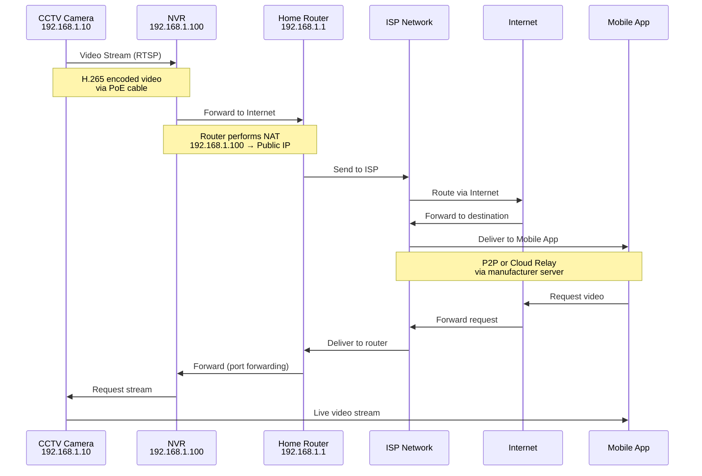

---

## Diagram 4: IPv4 Address Structure

```
IPv4 Address: 192.168.1.100

┌─────────────────────────────────────────────────────────────────┐
│                    BINARY REPRESENTATION                        │
├─────────────────────────────────────────────────────────────────┤
│                                                                 │
│   192      .      168      .       1      .      100           │
│                                                                 │
│  11000000  .  10101000  .  00000001  .  01100100               │
│                                                                 │
├─────────────────────────────────────────────────────────────────┤
│                                                                 │
│  ┌─────────────────────────┐  ┌────────────────────────────┐   │
│  │    NETWORK PORTION      │  │      HOST PORTION          │   │
│  │    (192.168.1)          │  │      (.100)                │   │
│  │    24 bits              │  │      8 bits                │   │
│  │    Subnet: 255.255.255.0│  │      Host ID: 100          │   │
│  └─────────────────────────┘  └────────────────────────────┘   │
│                                                                 │
├─────────────────────────────────────────────────────────────────┤
│  SUBNET MASK: 255.255.255.0 (/24)                              │
│  • First 24 bits = 1s (network)                                │
│  • Last 8 bits = 0s (hosts)                                    │
│  • Supports 254 devices (192.168.1.1 - 192.168.1.254)          │
└─────────────────────────────────────────────────────────────────┘
```

---

## Diagram 5: Subnetting for Multi-floor CCTV

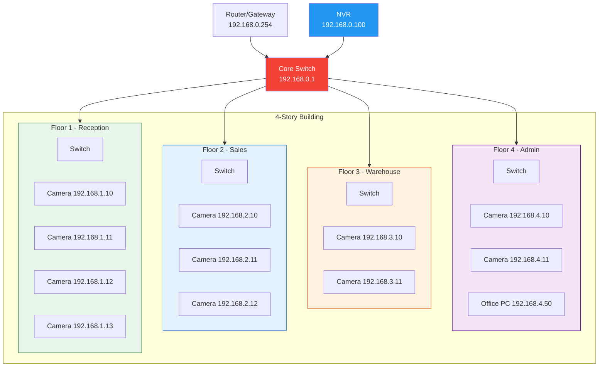

**Subnet Table:**
| Floor | Subnet | Range | Devices |
|-------|--------|-------|---------|
| Floor 1 | 192.168.1.0/24 | .1 - .254 | 4 cameras, reception |
| Floor 2 | 192.168.2.0/24 | .1 - .254 | 3 cameras, sales team |
| Floor 3 | 192.168.3.0/24 | .1 - .254 | 2 cameras, warehouse |
| Floor 4 | 192.168.4.0/24 | .1 - .254 | 2 cameras, admin |

---

# CHAPTER 12 - BUSINESS MODEL

---

## Diagram 6: Access Control System Architecture

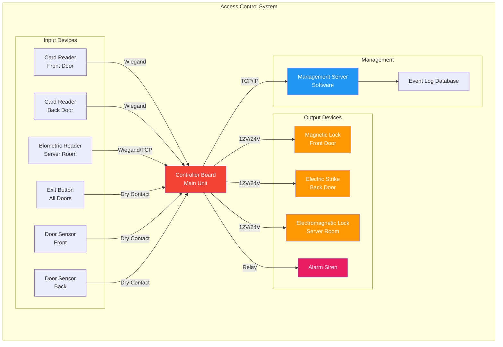

---

## Diagram 7: Access Control Working Flow

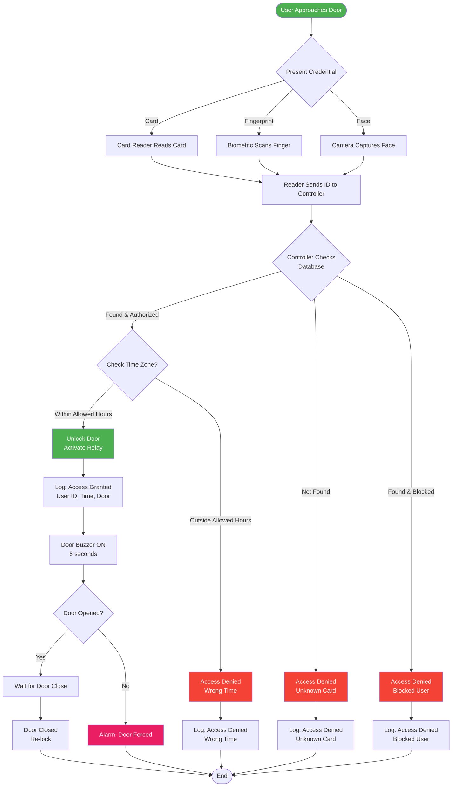

---

## Diagram 8: Controller Board Layout

```
┌─────────────────────────────────────────────────────────────────────┐
│                    ACCESS CONTROL CONTROLLER BOARD                  │
│                        (4-Door Controller)                          │
├─────────────────────────────────────────────────────────────────────┤
│                                                                     │
│  ┌──────────┐    ┌──────────────────────────────────────────────┐  │
│  │ POWER    │    │                  STATUS LEDs                 │  │
│  │ INPUT    │    │  [PWR] [RUN] [COM] [DOOR1] [DOOR2] [DOOR3] │  │
│  │          │    │   ●     ●     ●      ●       ●       ●      │  │
│  │ 12V ●───┤    └──────────────────────────────────────────────┘  │
│  │ GND ●───┤                                                       │
│  └──────────┘                                                       │
│                                                                     │
│  ┌─────────────────────────────────────────────────────────────┐   │
│  │                    READER INPUTS (Wiegand)                  │   │
│  │  ┌──────────┐  ┌──────────┐  ┌──────────┐  ┌──────────┐   │   │
│  │  │ Reader 1 │  │ Reader 2 │  │ Reader 3 │  │ Reader 4 │   │   │
│  │  │ DATA0 ●  │  │ DATA0 ●  │  │ DATA0 ●  │  │ DATA0 ●  │   │   │
│  │  │ DATA1 ●  │  │ DATA1 ●  │  │ DATA1 ●  │  │ DATA1 ●  │   │   │
│  │  │ GND  ●   │  │ GND  ●   │  │ GND  ●   │  │ GND  ●   │   │   │
│  │  └──────────┘  └──────────┘  └──────────┘  └──────────┘   │   │
│  └─────────────────────────────────────────────────────────────┘   │
│                                                                     │
│  ┌─────────────────────────────────────────────────────────────┐   │
│  │                    DOOR RELAY OUTPUTS                       │   │
│  │  ┌──────────┐  ┌──────────┐  ┌──────────┐  ┌──────────┐   │   │
│  │  │ Door 1   │  │ Door 2   │  │ Door 3   │  │ Door 4   │   │   │
│  │  │ COM  ●   │  │ COM  ●   │  │ COM  ●   │  │ COM  ●   │   │   │
│  │  │ NO   ●   │  │ NO   ●   │  │ NO   ●   │  │ NO   ●   │   │   │
│  │  │ NC   ●   │  │ NC   ●   │  │ NC   ●   │  │ NC   ●   │   │   │
│  │  └──────────┘  └──────────┘  └──────────┘  └──────────┘   │   │
│  └─────────────────────────────────────────────────────────────┘   │
│                                                                     │
│  ┌─────────────────────────────────────────────────────────────┐   │
│  │                    AUXILIARY I/O                            │   │
│  │  [Exit Btn 1] [Exit Btn 2] [Door Sensor 1] [Door Sensor 2]│   │
│  │      ●              ●              ●              ●        │   │
│  │  [Alarm Out 1] [Alarm Out 2]   [RS485 A]   [RS485 B]      │   │
│  │      ●              ●              ●              ●        │   │
│  └─────────────────────────────────────────────────────────────┘   │
│                                                                     │
│  ┌──────────────┐  ┌──────────────┐  ┌────────────────────────┐   │
│  │  Ethernet    │  │   Reset      │  │     Terminal Block     │   │
│  │  Port        │  │   Button     │  │     (Expansion)        │   │
│  │  [RJ45]      │  │   [●]        │  │     ● ● ● ● ● ●      │   │
│  └──────────────┘  └──────────────┘  └────────────────────────┘   │
│                                                                     │
└─────────────────────────────────────────────────────────────────────┘
```

---

## Diagram 9: Magnetic Lock Installation

```
                    MAGNETIC LOCK INSTALLATION
                    
     DOOR FRAME (Fixed)              DOOR (Movable)
    ┌───────────────────┐           ┌───────────────────┐
    │                   │           │                   │
    │   ┌───────────┐   │           │   ┌───────────┐   │
    │   │           │   │           │   │           │   │
    │   │ELECTRO-   │   │  ←0.5mm→  │   │ ARMATURE  │   │
    │   │MAGNET     │   │   GAP     │   │ PLATE     │   │
    │   │           │   │           │   │ (Steel)   │   │
    │   │  12V+ ────┼───┼─── Power Wires ───┼──── 12V+│   │
    │   │  GND  ────┼───┼───────────────────┼──── GND │   │
    │   │           │   │           │   │           │   │
    │   └───────────┘   │           │   └───────────┘   │
    │                   │           │                   │
    │   Mounting Holes  │           │   Mounting Bolt   │
    │   (4x screws)     │           │   (Counter-sunk)  │
    │                   │           │                   │
    └───────────────────┘           └───────────────────┘
    
    SPECIFICATIONS:
    ┌────────────────────────────────────────────────┐
    │ Holding Force:    600 lbs (272 kg)             │
    │ Operating Voltage: 12V DC                      │
    │ Current Draw:     480mA @ 12V                  │
    │ Gap:              Maximum 0.5mm                │
    │ Material:         Electromagnet + Steel Plate  │
    │ Certification:    UL, CE                       │
    └────────────────────────────────────────────────┘
    
    WIRING:
    ┌──────────────────┐         ┌──────────────────┐
    │  Controller Board │         │  Magnetic Lock   │
    │                  │         │                  │
    │  LOCK+ ●────────┼─────────┼──── ● 12V+       │
    │  LOCK- ●────────┼─────────┼──── ● GND        │
    │                  │         │                  │
    │  (NO Contact)    │         │  (Optional)      │
    │  COM ●──────────┼─────────┼──── ● Door Sensor│
    │  NO  ●──────────┼─────────┼──── ● (to alarm) │
    └──────────────────┘         └──────────────────┘
```

---

## Diagram 10: Boom Barrier System

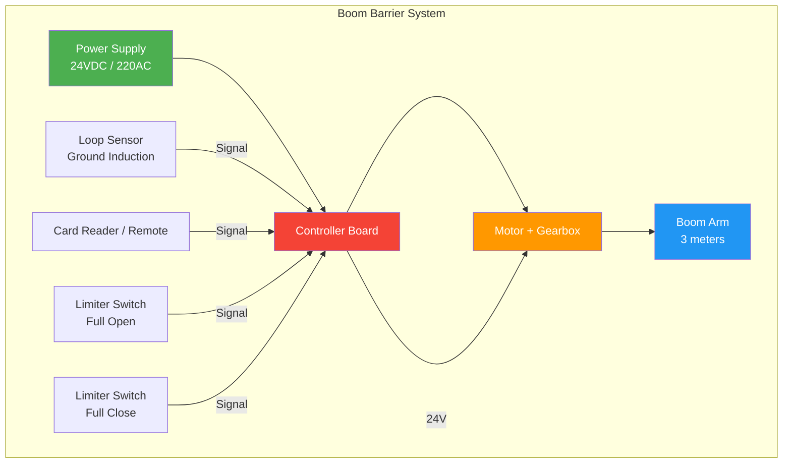

---

## Diagram 11: Boom Barrier Working Flow

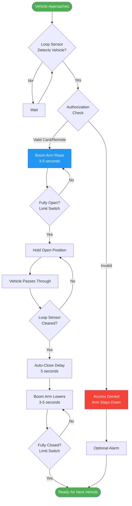

---

## Diagram 14: Vehicle Loop Sensor in Ground

```
                    VEHICLE LOOP SENSOR INSTALLATION
                    
    TOP VIEW:
    ┌─────────────────────────────────────────────────────────────┐
    │                                                             │
    │    Saw-cut groove (5mm wide x 50mm deep)                   │
    │    ┌─────────────────────────────────────────────────┐     │
    │    │                                                 │     │
    │    │    ┌─────────────────────────────────────┐     │     │
    │    │    │                                     │     │     │
    │    │    │         VEHICLE LOOP WIRE           │     │     │
    │    │    │         (4-6 turns)                 │     │     │
    │    │    │                                     │     │     │
    │    │    │    ┌───────────────────────┐       │     │     │
    │    │    │    │                       │       │     │     │
    │    │    │    │   DETECTION ZONE      │       │     │     │
    │    │    │    │   (Vehicle stops here)│       │     │     │
    │    │    │    │                       │       │     │     │
    │    │    │    └───────────────────────┘       │     │     │
    │    │    │                                     │     │     │
    │    │    └─────────────────────────────────────┘     │     │
    │    │                                                 │     │
    │    └─────────────────────────────────────────────────┘     │
    │                          │                                  │
    │                    Lead wires to                           │
    │                    Detector Unit                           │
    │                                                             │
    └─────────────────────────────────────────────────────────────┘
    
    CROSS SECTION:
    
    Ground Level
    ═══════════════════════════════════════════════════════════════
    ┌─────────┐  ┌─────────┐  ┌─────────┐  ┌─────────┐
    │ Sealant │  │ Sealant │  │ Sealant │  │ Sealant │  ← Polyurethane
    │ (filled)│  │ (filled)│  │ (filled)│  │ (filled)│    sealant
    └────┬────┘  └────┬────┘  └────┬────┘  └────┬────┘
         │            │            │            │
    ┌────┴────┐  ┌────┴────┐  ┌────┴────┐  ┌────┴────┐
    │  Loop   │  │  Loop   │  │  Loop   │  │  Loop   │  ← Loop wire
    │  Wire   │  │  Wire   │  │  Wire   │  │  Wire   │    (insulated)
    │ (turn 1)│  │ (turn 2)│  │ (turn 3)│  │ (turn 4)│
    └─────────┘  └─────────┘  └─────────┘  └─────────┘
    
    ├─────────── 50mm depth ───────────┤
    ├──── 5mm width ────┤
    
    TO DETECTOR UNIT:
    ┌─────────────────────────────────────────┐
    │         LOOP DETECTOR UNIT              │
    │                                         │
    │  [Loop Input]  [Sensitivity] [Relay Out]│
    │      ●             ●             ●      │
    │                                         │
    │  LED: [POWER] [DETECT] [FAULT]         │
    │         ●        ●        ●            │
    └─────────────────────────────────────────┘
```

---

## Diagram 15: VDP System Overview

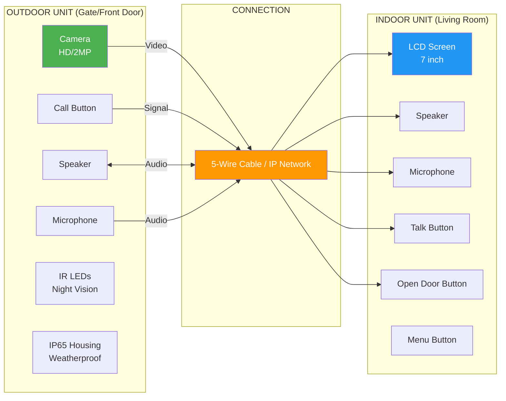

---

## Diagram 18: Wired VDP Connection

```
            WIRED VDP CONNECTION (5-WIRE SYSTEM)
            
┌──────────────────────┐                    ┌──────────────────────┐
│    OUTDOOR UNIT      │                    │    INDOOR UNIT       │
│                      │                    │                      │
│  ┌──────────────┐    │    5-WIRE CABLE    │  ┌──────────────┐    │
│  │   Camera     │    │                    │  │   LCD Screen │    │
│  └──────────────┘    │                    │  └──────────────┘    │
│                      │                    │                      │
│  ┌──────────────┐    │   ┌──────────┐    │  ┌──────────────┐    │
│  │ Call Button  │──┼──────│ RED      │────┼──│ Power Input  │    │
│  └──────────────┘    │   │ (12V)    │    │  └──────────────┘    │
│                      │   ├──────────┤    │                      │
│  ┌──────────────┐    │   │ BLACK    │    │  ┌──────────────┐    │
│  │  Speaker     │──┼──────│ (GND)   │────┼──│ Ground       │    │
│  └──────────────┘    │   ├──────────┤    │  └──────────────┘    │
│                      │   │ YELLOW   │    │                      │
│  ┌──────────────┐    │   │ (Video)  │    │  ┌──────────────┐    │
│  │  Microphone  │──┼──────│          │────┼──│ Video In     │    │
│  └──────────────┘    │   ├──────────┤    │  └──────────────┘    │
│                      │   │ WHITE    │    │                      │
│  ┌──────────────┐    │   │ (Audio)  │    │  ┌──────────────┐    │
│  │ IR LEDs      │    │   │          │    │  │ Audio In/Out │    │
│  └──────────────┘    │   ├──────────┤    │  └──────────────┘    │
│                      │   │ GREEN    │    │                      │
│  ┌──────────────┐    │   │ (Lock)   │    │  ┌──────────────┐    │
│  │  Lock Out    │──┼──────│          │────┼──│ Open Button  │    │
│  └──────────────┘    │   └──────────┘    │  └──────────────┘    │
│                      │                    │                      │
└──────────────────────┘                    └──────────────────────┘

WIRE COLOR CODE:
┌─────────┬────────────┬─────────────────────────┐
│ Color   │ Function   │ Voltage/Signal          │
├─────────┼────────────┼─────────────────────────┤
│ RED     │ Power      │ +12V DC (1A)            │
│ BLACK   │ Ground     │ 0V (Common)             │
│ YELLOW  │ Video      │ Composite Video (1Vpp)  │
│ WHITE   │ Audio      │ Bidirectional Audio     │
│ GREEN   │ Lock       │ Dry Contact / 12V       │
└─────────┴────────────┴─────────────────────────┘
```

---

## Diagram 19: IP VDP Network Connection

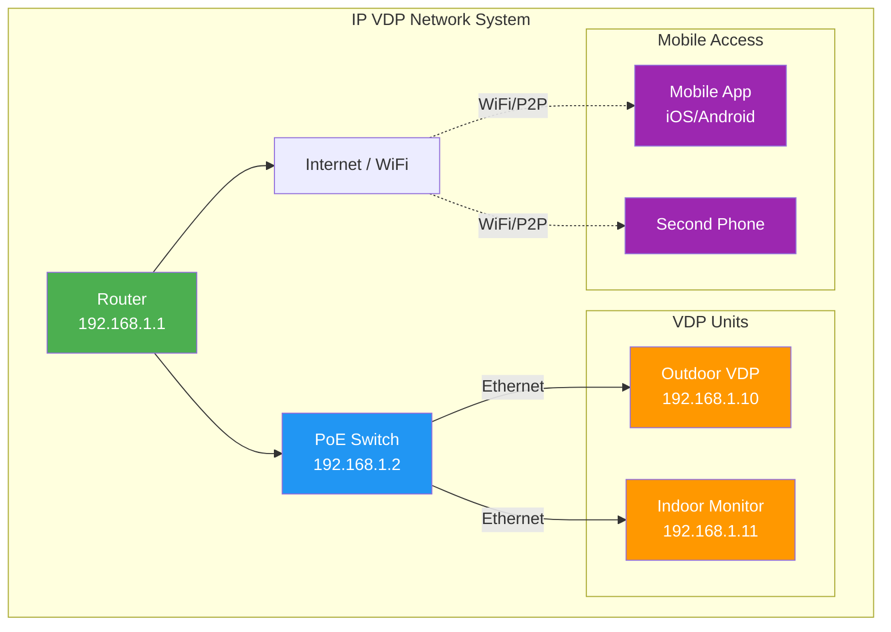

---

## Diagram 20: VDP + CCTV Integration

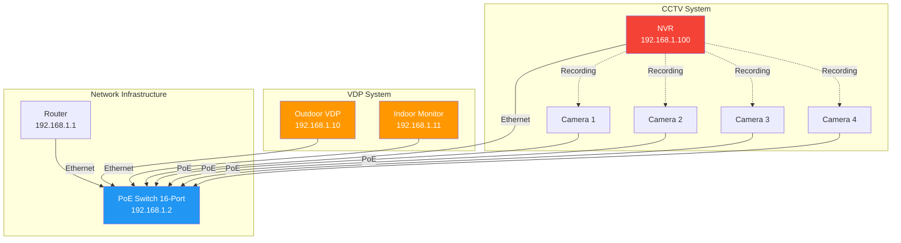

---

## Diagram 21: SLA Sample Document

```
┌─────────────────────────────────────────────────────────────────────┐
│                    SERVICE LEVEL AGREEMENT (SLA)                    │
│                   CCTV Maintenance Contract                        │
├─────────────────────────────────────────────────────────────────────┤
│                                                                     │
│  CLIENT: _______________________    DATE: ___/___/______           │
│  SITE:   _______________________    CONTRACT #: _________          │
│                                                                     │
├─────────────────────────────────────────────────────────────────────┤
│  1. SCOPE OF SERVICE                                               │
│  ┌─────────────────────────────────────────────────────────────┐   │
│  │ • Preventive Maintenance: Quarterly                        │   │
│  │ • Corrective Maintenance: As needed                        │   │
│  │ • Remote Monitoring: 24/7                                   │   │
│  │ • Software Updates: Included                               │   │
│  │ • Spare Parts: Included (up to ₹5,000/year)               │   │
│  └─────────────────────────────────────────────────────────────┘   │
│                                                                     │
├─────────────────────────────────────────────────────────────────────┤
│  2. RESPONSE TIMES                                                  │
│  ┌────────────────┬──────────────┬──────────────┬──────────────┐   │
│  │ Priority       │ Response     │ Resolution   │ Escalation   │   │
│  ├────────────────┼──────────────┼──────────────┼──────────────┤   │
│  │ CRITICAL       │ 1 hour       │ 4 hours      │ Immediate    │   │
│  │ (Full system   │              │              │              │   │
│  │  down)         │              │              │              │   │
│  ├────────────────┼──────────────┼──────────────┼──────────────┤   │
│  │ MAJOR          │ 4 hours      │ 24 hours     │ 8 hours      │   │
│  │ (Multiple      │              │              │              │   │
│  │  cameras down) │              │              │              │   │
│  ├────────────────┼──────────────┼──────────────┼──────────────┤   │
│  │ MINOR          │ 24 hours     │ 72 hours     │ 48 hours     │   │
│  │ (Single camera │              │              │              │   │
│  │  issue)        │              │              │              │   │
│  └────────────────┴──────────────┴──────────────┴──────────────┘   │
│                                                                     │
├─────────────────────────────────────────────────────────────────────┤
│  3. PENALTIES                                                       │
│  ┌─────────────────────────────────────────────────────────────┐   │
│  │ • Response time exceeded: 5% credit per incident           │   │
│  │ • Resolution time exceeded: 10% credit per incident       │   │
│  │ • Monthly uptime below 99%: 15% credit                    │   │
│  │ • Maximum credit: 30% of monthly fee                      │   │
│  └─────────────────────────────────────────────────────────────┘   │
│                                                                     │
├─────────────────────────────────────────────────────────────────────┤
│  4. MONTHLY FEE: ₹ _____________                                   │
│                                                                     │
│  CLIENT SIGNATURE: _________________  DATE: ___/___/______         │
│  PROVIDER SIGNATURE: ________________ DATE: ___/___/______         │
│                                                                     │
└─────────────────────────────────────────────────────────────────────┘
```

---

## Diagram 22: Career Path Chart

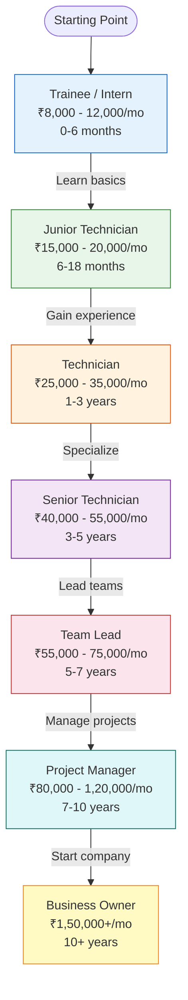

---

## Diagram 23: Company Growth Stages

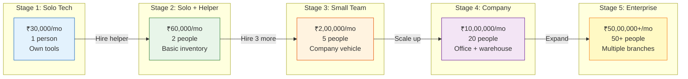

---

# CHAPTER 13 - PRACTICAL EXAMINATION

---

## Diagram 25: Network Test Topology

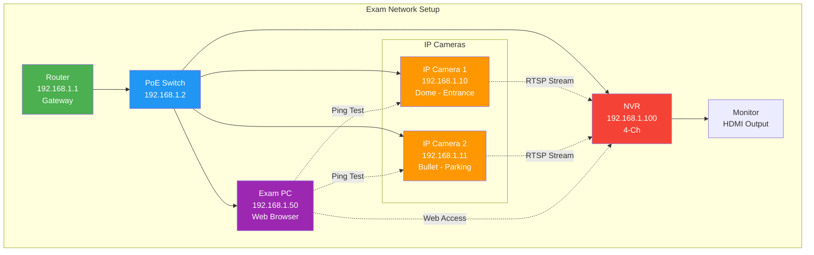

**IP Assignment Table:**
| Device | IP Address | Subnet Mask | Gateway |
|--------|------------|-------------|---------|
| Router | 192.168.1.1 | 255.255.255.0 | - |
| PoE Switch | 192.168.1.2 | 255.255.255.0 | 192.168.1.1 |
| IP Camera 1 | 192.168.1.10 | 255.255.255.0 | 192.168.1.1 |
| IP Camera 2 | 192.168.1.11 | 255.255.255.0 | 192.168.1.1 |
| NVR | 192.168.1.100 | 255.255.255.0 | 192.168.1.1 |
| Exam PC | 192.168.1.50 | 255.255.255.0 | 192.168.1.1 |

---

# CHAPTER 14 - FEEDBACK & CERTIFICATION

---

## Diagram 26: Feedback to Improvement Cycle

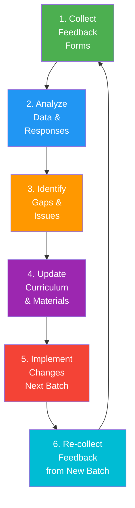

---

# DIAGRAMS THAT NEED EXTERNAL TOOLS

These diagrams cannot be created in Mermaid/ASCII and require specialized tools:

| # | Diagram | Tool Needed | Why |
|---|---------|-------------|-----|
| 8 | Controller Board Layout | draw.io / Figma | Detailed PCB layout with labeled components |
| 12 | Boom Barrier Component Layout | draw.io / AutoCAD | Exploded view with dimensions |
| 13 | Foundation Dimensions | AutoCAD / draw.io | Precise cross-section with measurements |
| 16 | Outdoor Unit Anatomy | draw.io / Figma | Labeled product photo overlay |
| 17 | Indoor Monitor | draw.io / Figma | Labeled product photo overlay |
| 24 | Exam Station Layout | AutoCAD / draw.io | Floor plan with dimensions |

---

# SUMMARY

| Diagram # | Title | Format | Status |
|-----------|-------|--------|--------|
| 1 | LAN Network Layout | Mermaid | ✅ Done |
| 2 | LAN vs WAN Architecture | Mermaid | ✅ Done |
| 3 | Internet Data Path | Mermaid | ✅ Done |
| 4 | IPv4 Address Structure | ASCII Art | ✅ Done |
| 5 | Subnetting Multi-floor | Mermaid | ✅ Done |
| 6 | Access Control Architecture | Mermaid | ✅ Done |
| 7 | Access Control Working Flow | Mermaid | ✅ Done |
| 8 | Controller Board Layout | External | ❌ Need draw.io |
| 9 | Magnetic Lock Installation | ASCII Art | ✅ Done |
| 10 | Boom Barrier System | Mermaid | ✅ Done |
| 11 | Boom Barrier Working Flow | Mermaid | ✅ Done |
| 12 | Boom Barrier Component Layout | External | ❌ Need draw.io |
| 13 | Foundation Dimensions | External | ❌ Need AutoCAD |
| 14 | Vehicle Loop Sensor | ASCII Art | ✅ Done |
| 15 | VDP System Overview | Mermaid | ✅ Done |
| 16 | Outdoor Unit Anatomy | External | ❌ Need Figma |
| 17 | Indoor Monitor | External | ❌ Need Figma |
| 18 | Wired VDP Connection | ASCII Art | ✅ Done |
| 19 | IP VDP Network | Mermaid | ✅ Done |
| 20 | VDP + CCTV Integration | Mermaid | ✅ Done |
| 21 | SLA Sample | ASCII Art | ✅ Done |
| 22 | Career Path Chart | Mermaid | ✅ Done |
| 23 | Company Growth Stages | Mermaid | ✅ Done |
| 24 | Exam Station Layout | External | ❌ Need AutoCAD |
| 25 | Network Test Topology | Mermaid | ✅ Done |
| 26 | Feedback Cycle | Mermaid | ✅ Done |

**Created: 20 diagrams | Need External Tools: 6 diagrams**
