# CCTV Installation - Training Notes

**Quick Reference Guide for Technicians**

---

# Table of Contents

1. [Introduction to CCTV](#chapter-1-introduction-to-cctv)
2. [Components and Tools](#chapter-2-components-and-tools)
3. [Analog CCTV Systems](#chapter-3-analog-cctv-systems)
4. [Networking Fundamentals](#chapter-4-networking-fundamentals)
5. [IP CCTV Systems](#chapter-5-ip-cctv-systems)
6. [Storage](#chapter-6-storage)
7. [Wireless Cameras](#chapter-7-wireless-cameras)
8. [Site Survey](#chapter-8-site-survey)
9. [Troubleshooting](#chapter-9-troubleshooting)
10. [Quotation and Sales](#chapter-10-quotation-and-sales)
11. [Billing and Handover](#chapter-11-billing-and-handover)
12. [Business Model](#chapter-12-business-model)
13. [Practical Examination](#chapter-13-practical-examination)
14. [Feedback and Certification](#chapter-14-feedback-and-certification)

---

# Chapter 1: Introduction to CCTV

## 1.1 What is CCTV?

**CCTV = Closed Circuit Television**

Yani jo TV live dikhata hai, lekin sirf ek specific jagah ka. Ye "closed" hai matlab public nahi hai - sirf authorized log dekh sakte hain.

| Term | Full Form | Meaning |
|------|-----------|---------|
| CCTV | Closed Circuit Television | Live video monitoring system |
| Surveillance | Nigrani | Watching over a area |
| DVR | Digital Video Recorder | Analog video record karne wala device |
| NVR | Network Video Recorder | IP video record karne wala device |
| IP Camera | Internet Protocol Camera | Network se connected camera |

> **[TIP]** CCTV ko "Security Camera" bhi bolte hain. Dono same cheez hai.

### Why CCTV is Important

1. **Crime Prevention** - criminals dar jaate hain
2. **Evidence Collection** - police ko proof milta hai
3. **Remote Monitoring** - phone se bhi dekh sakte ho
4. **Employee Monitoring** - staff ki activity track karo
5. **Safety** - accidents aur incidents record hote hain

[Image: Old CRT monitor CCTV setup vs modern IP CCTV setup]

## 1.2 Types of CCTV Systems

### By Technology

| Type | Signal | Cable | Distance | Cost | Quality |
|------|--------|-------|----------|------|---------|
| Analog | Video (CVBS) | Coaxial (RG59) | 300m max | Low | 720p-1080p |
| HD Analog | HD Video | Coaxial (RG59) | 500m | Medium | 720p-4K |
| IP | Digital | CAT5e/CAT6 | 100m (with PoE) | Medium-High | 1080p-4K+ |
| Wireless | WiFi | No cable | 50-100m | Medium | 1080p |
| Hybrid | Both | Both | Varies | High | Varies |

### By Camera Type

| Type | Best For | Features |
|------|----------|----------|
| Dome | Indoor, Office | Vandal-proof, 360° look |
| Bullet | Outdoor, Long range | Visible deterrent, weatherproof |
| PTZ | Large areas | Pan, Tilt, Zoom, 360° coverage |
| Varifocal | Flexible install | Adjustable focal length |
| Hidden | Covert surveillance | Disguised as everyday objects |
| Fisheye | 360° panoramic | Single camera, full room view |

[Image: Types of CCTV cameras - Dome, Bullet, PTZ, Varifocal]

## 1.3 CCTV System Components

### Basic Analog System

```
Camera → Coaxial Cable → DVR → Monitor
                    ↓
              Power Supply (12V DC)
```

### Basic IP System

```
Camera → Ethernet Cable → PoE Switch → NVR → Monitor
                   ↓
            Router → Internet → Mobile App
```

### Components List

| Component | Function | Analog | IP |
|-----------|----------|--------|-----|
| Camera | Captures video | Yes | Yes |
| Cable | Transmits signal | Coaxial | Ethernet |
| Recorder | Stores video | DVR | NVR |
| Monitor | Displays video | Yes | Yes |
| Power | Powers devices | 12V DC adapter | PoE |
| Storage | Saves footage | HDD in DVR | HDD in NVR |

> **[DO]** Hamesha system ka signal flow samjho pehle. Camera se lekar monitor tak kaise jaata hai.

---

### MCQs - Chapter 1

**Q1. CCTV ka full form kya hai?**
- A) Central Circuit Television
- B) Closed Circuit Television ✅
- C) Camera Circuit Television
- D) Common Circuit Television

**Q2. Analog camera mein kaunsa cable use hota hai?**
- A) CAT5e
- B) Fiber optic
- C) Coaxial (RG59) ✅
- D) HDMI

**Q3. IP camera kitne distance tak kaam karta hai (single cable)?**
- A) 50m
- B) 100m ✅
- C) 300m
- D) 500m

**Q4. Kaunsa camera 360 degree ghum sakta hai?**
- A) Dome
- B) Bullet
- C) PTZ ✅
- D) Varifocal

**Q5. CCTV system mein video record kaun karta hai?**
- A) Router
- B) Switch
- C) DVR/NVR ✅
- D) Monitor

---

# Chapter 2: Components and Tools

## 2.1 Connectors

### BNC Connector

**BNC = Bayonet Neill-Concelman**

Ye connector coaxial cable mein use hota hai analog CCTV ke liye.

| Feature | Detail |
|---------|--------|
| Used for | Analog cameras |
| Cable | RG59 Coaxial |
| Type | Male (camera end), Female (DVR end) |
| Crimping tool | BNC crimper |

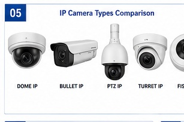

### DC Power Connector

**DC = Direct Current**

Camera ko power dene ke liye use hota hai. 2 types hain:
- **Male** - Camera mein lagta hai
- **Female** - Power supply se connect hota hai

| Size | Use |
|------|-----|
| 2.1mm x 5.5mm | Most cameras |
| 2.5mm x 5.5mm | Some NVRs |

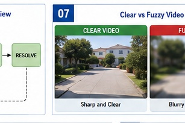

### RJ45 Connector

**RJ45 = Registered Jack 45**

Ye connector network cables mein use hota hai IP cameras ke liye.

| Feature | Detail |
|---------|--------|
| Used for | IP cameras, NVR, Switch |
| Cable | CAT5e / CAT6 |
| Pins | 8 pins |
| Standard | T568A / T568B |

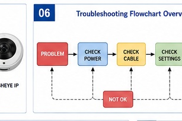

> **[TIP]** Hamesha T568B standard use karo. Ye industry standard hai.

## 2.2 Cables

### Coaxial Cable (RG59)

```
┌─────────────────────────────────────┐
│  Outer Jacket (PVC)                 │
│  ┌─────────────────────────────┐   │
│  │  Braided Shield (Copper)    │   │
│  │  ┌─────────────────────┐   │   │
│  │  │  Foil Shield        │   │   │
│  │  │  ┌─────────────┐   │   │   │
│  │  │  │  Inner Conductor│   │   │   │
│  │  │  │  (Copper)      │   │   │   │
│  │  │  └─────────────┘   │   │   │
│  │  └─────────────────────┘   │   │
│  └─────────────────────────────┘   │
└─────────────────────────────────────┘
```

| Type | Distance | Quality | Use |
|------|----------|---------|-----|
| RG59 | 300m | 1080p | Analog CCTV |
| RG6 | 500m | 4K | HD Analog |
| RG11 | 1000m | 4K | Long distance |

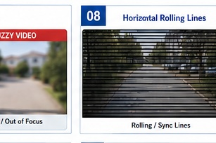

### CAT5e/CAT6 Cable

| Feature | CAT5e | CAT6 |
|---------|-------|------|
| Speed | 1 Gbps | 10 Gbps |
| Distance | 100m | 100m |
| Bandwidth | 100 MHz | 250 MHz |
| Use | IP cameras | IP cameras (better) |

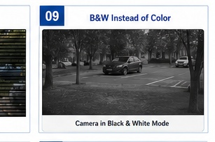

### Fiber Optic Cable

| Feature | Single Mode | Multi Mode |
|---------|-------------|------------|
| Distance | Up to 10km | Up to 2km |
| Speed | 100 Gbps | 10 Gbps |
| Cost | High | Medium |
| Use | Long distance | Building backbone |

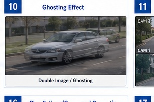

> **[WARNING]** Fiber optic cable bahut fragile hai. Handle carefully. Break ho jaye toh signal loss hoga.

## 2.3 Cable Management

### PVC Conduit

- Pipes jo cables ko protect karte hain
- Indoor/outdoor use hota hai
- Sizes: 20mm, 25mm, 32mm


### Cable Trunking

- Rectangular boxes jo wall pe lagte hain
- Easy access for maintenance
- Clean look deta hai


### Cable Ties

- Cables ko organize karne ke liye
- Plastic zip ties
- Reusable aur non-reusable types


## 2.4 Testing Tools

### Cable Tester

- Cable continuity check karta hai
- Wire mapping dikhata hai
-断线, short circuit detect karta hai

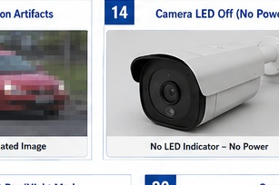

### Multimeter

- Voltage check karta hai
- Continuity test karta hai
- Resistance measure karta hai

| Setting | Use |
|---------|-----|
| DCV (20V) | 12V DC power check |
| Continuity | Cable break check |
| Resistance | Cable quality check |

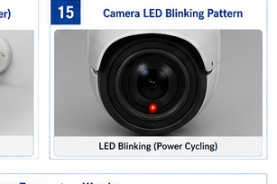

> **[DO]** Hamesha pehle voltage check karo. Wrong voltage se camera jal sakta hai.

## 2.5 Tools Kit

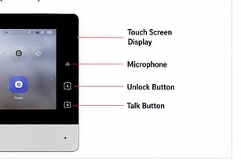

### Essential Tools List

| Tool | Use |
|------|-----|
| Crimping Tool | RJ45/BNC bananaana |
| Wire Stripper | Cable ka jacket katna |
| Cable Tester | Cable check karna |
| Multimeter | Voltage check karna |
| Drill Machine | Holes banana |
| Screwdriver Set | Screws tight karna |
| Plier | Wires pakadna |
| Cutting Plier | Wires katna |

---

### MCQs - Chapter 2

**Q1. BNC connector kis cable mein use hota hai?**
- A) CAT6
- B) Coaxial (RG59) ✅
- C) Fiber optic
- D) HDMI

**Q2. CAT6 cable ka maximum distance kitna hai?**
- A) 50m
- B) 100m ✅
- C) 300m
- D) 500m

**Q3. Multimeter se kya check karte hain?**
- A) Video signal
- B) Audio signal
- C) Voltage ✅
- D) Internet speed

**Q4. PVC conduit ka kya kaam hai?**
- A) Cable ko power dena
- B) Cable ko protect karna ✅
- C) Video signal badhana
- D) Internet speed badhana

**Q5. Crimping tool se kya banta hai?**
- A) BNC connector ✅
- B) Power supply
- C) DVR
- D) Monitor

---

# Chapter 3: Analog CCTV Systems

## 3.1 Camera Types

### Dome Camera

- **Shape:** Dome (gol) shape
- **Use:** Indoor, offices, shops
- **Feature:** Vandal-proof, 360° view
- **Mounting:** Ceiling pe lagta hai

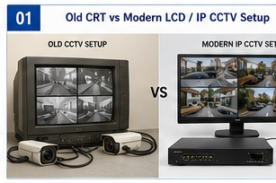

### Bullet Camera

- **Shape:** Cylindrical (lamba)
- **Use:** Outdoor, long range
- **Feature:** Weatherproof, visible deterrent
- **Mounting:** Wall pe lagta hai

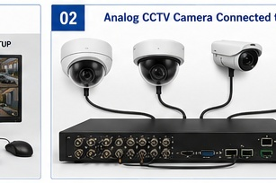

### PTZ Camera

**PTZ = Pan, Tilt, Zoom**

- **Pan:** 360° ghum sakta hai
- **Tilt:** Upar-neeche ho sakta hai
- **Zoom:** Door cheezon ko paas la sakta hai
- **Use:** Large areas, parking, warehouses

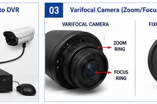

> **[TIP]** PTZ camera ko "presets" set kar sakte ho - specific positions save karke automatic ghumta hai.

## 3.2 DVR (Digital Video Recorder)

**DVR = Digital Video Recorder**

Analog cameras ke video ko record karta hai.

| Feature | Details |
|---------|---------|
| Channels | 4, 8, 16, 32, 64 |
| Resolution | 720p, 1080p, 4K |
| Compression | H.264, H.265, H.265+ |
| Storage | 1-8 HDD support |
| Remote | Yes (via app) |

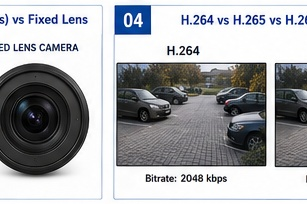

### DVR Features

| Feature | What it does |
|---------|--------------|
| Motion Detection | Movement pe record hota hai |
| Schedule Recording | Time set karke record hota hai |
| Continuous | 24/7 record hota hai |
| Playback | Recorded video dekh sakte ho |
| Export | USB pe video le sakte ho |

## 3.3 Compression

| Codec | Quality | Storage | Bandwidth |
|-------|---------|---------|-----------|
| H.264 | Good | High | High |
| H.265 | Better | Medium | Medium |
| H.265+ | Best | Low | Low |

> **[NOTE]** H.265+ use karo - 50% storage bachega H.264 se.

## 3.4 Installation Steps

1. Camera mount karo (ceiling/wall)
2. Cable lay karo (coaxial + power)
3. Connect karo camera ko DVR se
4. Power do cameras ko (12V DC)
5. DVR connect karo monitor se
6. DVR configure karo (resolution, recording)
7. Remote access set karo (port forwarding)

> **[WARNING]** Power off karke kaam karo. Live cable mat touch karo.

---

### MCQs - Chapter 3

**Q1. PTZ camera kya kar sakta hai?**
- A) Sirf record
- B) Pan, Tilt, Zoom ✅
- C) Sirf photos
- D) Sirf audio

**Q2. DVR kitne channels ka hota hai?**
- A) Sirf 4
- B) 4, 8, 16, 32, 64 ✅
- C) Sirf 16
- D) Sirf 32

**Q3. Kaunsa compression sabse best hai storage ke liye?**
- A) H.264
- B) H.265
- C) H.265+ ✅
- D) MPEG4

**Q4. Dome camera kahan lagta hai?**
- A) Outdoor
- B) Indoor (ceiling) ✅
- C) Ground
- D) Water mein

**Q5. Analog camera mein kaunsa cable use hota hai?**
- A) CAT6
- B) Coaxial ✅
- C) Fiber
- D) HDMI

---

# Chapter 4: Networking Fundamentals

## 4.1 What is Network?

**Network = Connected Devices**

Do ya zyada devices ka group jo ek dusre se communicate karein.

### Types of Networks

| Type | Full Form | Range | Example |
|------|-----------|-------|---------|
| LAN | Local Area Network | Building | Office cameras |
| WAN | Wide Area Network | City/Country | Multiple branch offices |
| WLAN | Wireless LAN | Room/Building | WiFi cameras |
| VPN | Virtual Private Network | Internet | Remote access |

[Diagram: LAN Network Layout for CCTV]

## 4.2 IP Address

**IP = Internet Protocol Address**

Ye device ka "address" hai network pe. Bina address ke device communicate nahi kar sakta.

### IPv4 Format

```
192.168.1.100

├───┤ ├───┤ ├───┤ ├───┤
  192   168    1    100

Ye 4 "octets" hain (8 bits each)
Total: 32 bits
```

### IP Classes

| Class | Range | Use |
|-------|-------|-----|
| A | 1.0.0.0 to 126.255.255.255 | Large networks |
| B | 128.0.0.0 to 191.255.255.255 | Medium networks |
| C | 192.0.0.0 to 223.255.255.255 | Small networks (CCTV) |

### Private IP Addresses (CCTV ke liye use karo)

| Class | Range | Devices |
|-------|-------|---------|
| Small | 192.168.0.1 - 192.168.0.254 | Up to 254 |
| Medium | 192.168.1.1 - 192.168.1.254 | Up to 254 |

[Diagram: IPv4 Address Structure]

## 4.3 Subnet Mask

**Subnet Mask = Network vs Host batata hai**

| Subnet Mask | CIDR | Devices | Use |
|-------------|------|---------|-----|
| 255.255.255.0 | /24 | 254 | Small CCTV |
| 255.255.0.0 | /16 | 65,534 | Large network |
| 255.0.0.0 | /8 | 16M+ | ISP level |

> **[TIP]** CCTV ke liye hamesha /24 (255.255.255.0) use karo. Ye 254 devices support karta hai.

## 4.4 Gateway aur DNS

**Gateway = Internet ka darwaza**

Device gateway ke through internet pe jaata hai. Usually router ka IP gateway hota hai.

**DNS = Domain Name System**

Ye website names ko IP addresses mein convert karta hai.
- google.com → 142.250.190.78

## 4.5 DHCP vs Static IP

| Feature | DHCP | Static IP |
|---------|------|-----------|
| IP Assignment | Automatic | Manual |
| Change | Ho sakta hai | Fixed |
| Use | Normal devices | Servers, NVR |
| CCTV | Camera ko de sakte ho | NVR ko do |

> **[DO]** NVR aur important devices ko hamesha static IP do. DHCP se IP change ho sakta hai.

## 4.6 Router aur Switch

**Router = Two networks ko connect karta hai**
- LAN to WAN (Internet)
- NAT (Network Address Translation)

**Switch = Devices ko connect karta hai ek network mein**
- Multiple devices ek network pe
- PoE switch cameras ko power bhi deta hai

[Diagram: Router vs Switch]

## 4.7 Ping Test

Ping se check karte hain device network pe hai ya nahi.

```
ping 192.168.1.100

Reply from 192.168.1.100: bytes=32 time=1ms TTL=64
Reply from 192.168.1.100: bytes=32 time=1ms TTL=64
Reply from 192.168.1.100: bytes=32 time=1ms TTL=64
```

| Response | Meaning |
|----------|---------|
| Reply | Device connected |
| Request timed out | Device not reachable |
| Destination host unreachable | Network issue |

---

### MCQs - Chapter 4

**Q1. LAN ka full form kya hai?**
- A) Large Area Network
- B) Local Area Network ✅
- C) Long Area Network
- D) Low Area Network

**Q2. IP address kitne bits ka hota hai?**
- A) 16 bits
- B) 32 bits ✅
- C) 64 bits
- D) 128 bits

**Q3. CCTV ke liye kaunsa subnet mask use karte hain?**
- A) 255.0.0.0
- B) 255.255.0.0
- C) 255.255.255.0 ✅
- D) 255.255.255.255

**Q4. Gateway kya karta hai?**
- A) Video record karta hai
- B) Internet se connect karta hai ✅
- C) Power deta hai
- D) Audio record karta hai

**Q5. NVR ko kya IP dena chahiye?**
- A) DHCP
- B) Static IP ✅
- C) Dynamic IP
- D) No IP

---

# Chapter 5: IP CCTV Systems

## 5.1 IP Camera

**IP Camera = Network Camera**

Ye camera network pe connect hota hai Ethernet cable se. Video digital format mein jaata hai.

| Feature | Analog Camera | IP Camera |
|---------|---------------|-----------|
| Cable | Coaxial | Ethernet |
| Resolution | 720p-1080p | 1080p-4K+ |
| Power | Separate 12V DC | PoE (cable se) |
| Distance | 300m | 100m |
| Features | Basic | Analytics, AI |
| Cost | Low | Medium-High |

[Image: IP Camera Types Comparison]

## 5.2 PoE (Power over Ethernet)

**PoE = Power over Ethernet**

Ek Ethernet cable se video + power dono jaata hai.

| PoE Standard | Power | Use |
|--------------|-------|-----|
| 802.3af (PoE) | 15.4W | Basic cameras |
| 802.3at (PoE+) | 30W | PTZ cameras |
| 802.3bt (PoE++) | 60-100W | High-power devices |

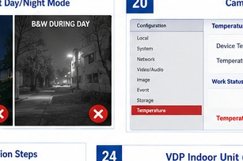

> **[TIP]** Hamesha PoE switch use karo IP cameras ke liye. Separate power supply ki zaroorat nahi.

## 5.3 NVR (Network Video Recorder)

**NVR = Network Video Recorder**

IP cameras ke video ko record karta hai.

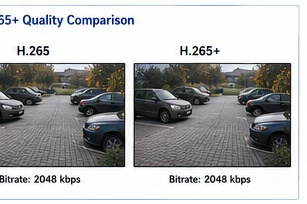

### NVR Features

| Feature | What it does |
|---------|--------------|
| Channel Count | 4, 8, 16, 32, 64 cameras |
| Resolution | Up to 12MP |
| Storage | 1-8 HDD |
| Analytics | Motion, Face, Line crossing |
| Remote Access | Mobile app, Web browser |

## 5.4 ONVIF

**ONVIF = Open Network Video Interface Forum**

Ye standard hai jo different brand ke cameras aur NVR ko compatible banata hai.

> **[NOTE]** ONVIF compatible camera + NVR = guaranteed support

## 5.5 RTSP

**RTSP = Real Time Streaming Protocol**

Ye protocol video streaming ke liye use hota hai. VLC player mein RTSP URL se live dekh sakte ho.

```
rtsp://192.168.1.100:554/stream1
```

## 5.6 Remote Viewing

1. NVR ko internet se connect karo (router se)
2. Port forwarding karo (ports 80, 554, 8000)
3. Mobile app install karo (厂商 app)
4. Device add karo (QR code ya manual)

[Diagram: IP CCTV Network Layout]

---

### MCQs - Chapter 5

**Q1. PoE ka full form kya hai?**
- A) Power over Ethernet ✅
- B) Power on Ethernet
- C) Protocol over Ethernet
- D) Port over Ethernet

**Q2. IP camera maximum kitna door kaam karta hai?**
- A) 50m
- B) 100m ✅
- C) 300m
- D) 500m

**Q3. ONVIF kya karta hai?**
- A) Video record karta hai
- B) Different brands ko compatible banata hai ✅
- C) Power deta hai
- D) Internet speed badhata hai

**Q4. RTSP URL se kya hota hai?**
- A) Video record hota hai
- B) Live video dekh sakte ho ✅
- C) Photos capture hote hain
- D) Audio record hota hai

**Q5. PoE+ kitna power deta hai?**
- A) 15.4W
- B) 30W ✅
- C) 60W
- D) 100W

---

# Chapter 6: Storage

## 6.1 Hard Disk Drive (HDD)

**HDD = Hard Disk Drive**

Video recordings store karne ke liye use hota hai.

| Feature | Normal HDD | Surveillance HDD |
|---------|------------|------------------|
| Usage | 8 hrs/day | 24/7 continuous |
| RPM | 5400-7200 | 7200 |
| Warranty | 2-3 years | 3-5 years |
| Reliability | Medium | High |
| Price | Low | Medium |

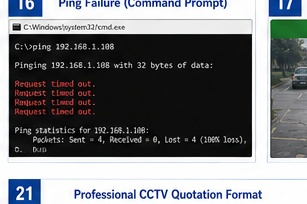

> **[WARNING]** Normal HDD CCTV mein mat lagao. Surveillance HDD lagao - ye 24/7 chal sakta hai.

## 6.2 Storage Calculation

### Formula

```
Storage (GB) = Bitrate (Mbps) × Days × Hours × Cameras × 3600
              ÷ 8 ÷ 1024
```

### Quick Reference

| Cameras | Resolution | Days (1TB HDD) |
|---------|------------|-----------------|
| 4 | 1080p H.265 | 30+ days |
| 8 | 1080p H.265 | 15-20 days |
| 16 | 1080p H.265 | 7-10 days |
| 32 | 1080p H.265 | 3-5 days |

## 6.3 Recording Modes

| Mode | When it Records | Storage Use |
|------|-----------------|-------------|
| Continuous | 24/7 | High |
| Motion Detection | Movement detected | Medium |
| Schedule | Time-based | Variable |
| Event | Alarm triggered | Low |

> **[DO]** Motion detection use karo storage bachane ke liye.

## 6.4 HDD Formatting

1. DVR/NVR menu mein jaao
2. Storage/ HDD settings mein jaao
3. Format option select karo
4. Confirm karo

> **[WARNING]** Format karne se saari recordings delete ho jaayengi!

---

### MCQs - Chapter 6

**Q1. CCTV mein kaunsa HDD use karna chahiye?**
- A) Normal HDD
- B) Surveillance HDD ✅
- C) SSD
- D) USB drive

**Q2. Storage calculation mein bitrate kya hai?**
- A) Speed of cable
- B) Video data rate ✅
- C) Power consumption
- D) Camera resolution

**Q3. Kaunsa recording mode sabse zyada storage leta hai?**
- A) Motion Detection
- B) Continuous ✅
- C) Schedule
- D) Event

**Q4. 4 cameras 1080p H.265 mein 1TB HDD mein kitne din record honge?**
- A) 7 din
- B) 15 din
- C) 30+ din ✅
- D) 60 din

**Q5. HDD format karne se kya hota hai?**
- A) Read speed badhti hai
- B) Saari recordings delete hoti hain ✅
- C) Storage badhta hai
- D) Camera connect hota hai

---

# Chapter 7: Wireless Cameras

## 7.1 WiFi Camera

**WiFi Camera = Cable ke bina camera**

Ye camera WiFi se connect hota hai. Power ke liye adapter chahiye ya battery hoti hai.

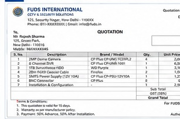

| Feature | WiFi Camera | Wired Camera |
|---------|-------------|--------------|
| Installation | Easy | Complex |
| Range | 50-100m | 100m (cable) |
| Reliability | Depends on WiFi | Very reliable |
| Bandwidth | Limited | Unlimited |
| Security | Less secure | More secure |

## 7.2 Cloud Camera

- Video internet pe store hota hai
- koi NVR ki zaroorat nahi
- Monthly subscription lagta hai
- Phone se kahi se bhi dekh sakte ho

## 7.3 Memory Card

| Capacity | Days (1080p) |
|----------|--------------|
| 32GB | 3-5 days |
| 64GB | 7-10 days |
| 128GB | 15-20 days |
| 256GB | 30+ days |

## 7.4 Mobile App Setup

1. App install karo (厂商 app)
2. Camera ko power do
3. QR code scan karo
4. WiFi credentials do
5. Camera add ho jaayega

## 7.5 Troubleshooting

| Problem | Solution |
|---------|----------|
| Camera offline | WiFi check karo, power check karo |
| Buffering | WiFi signal strong karo |
| Night vision not working | IR LEDs check karo |
| App not connecting | Internet check karo |

---

### MCQs - Chapter 7

**Q1. WiFi camera maximum kitna door kaam karta hai?**
- A) 10m
- B) 50-100m ✅
- C) 300m
- D) 500m

**Q2. Cloud camera mein video kahan store hota hai?**
- A) DVR mein
- B) NVR mein
- C) Internet cloud pe ✅
- D) Memory card mein

**Q3. 64GB memory card mein kitne din record hota hai?**
- A) 1-2 din
- B) 3-5 din
- C) 7-10 din ✅
- D) 30 din

**Q4. WiFi camera ka sabse bada disadvantage kya hai?**
- A) Cost
- B) WiFi reliability ✅
- C) Resolution
- D) Night vision

**Q5. Cloud camera mein kya chahiye subscription ke liye?**
- A) Free hai
- B) Monthly payment ✅
- C) Yearly payment
- D) Lifetime payment

---

# Chapter 8: Site Survey

## 8.1 What is Site Survey?

**Site Survey = Location ka analysis**

Installation se pehle location ka study karna ki cameras kahan lagenge, cables kahan se jaayengi.

### Why Site Survey is Important

1. Camera placement decide karna
2. Cable route plan karna
3. Network design banana
4. Cost estimate banana
5. Problems pehle se identify karna

## 8.2 Drawing Reading

### Types of Drawings

| Drawing | What it shows |
|---------|---------------|
| Floor Plan | Building ka top view |
| Elevation | Building ka side view |
| SLD | Single Line Diagram (electrical) |
| Network Diagram | Network ka layout |

## 8.3 Camera Planning

### Camera Placement Rules

1. **Entry/Exit Points** - Har gate pe camera
2. **Corners** - 45° angle pe lagao
3. **Height** - 3-4 meter height
4. **Avoid** - Direct sunlight, lights ke against
5. **Coverage** - Blind spots na rahein

### Camera Count Calculation

| Area | Cameras Needed |
|------|----------------|
| Room (10x10m) | 1-2 cameras |
| Corridor | 1 per 20m |
| Parking | 1 per 4-6 cars |
| Gate | 2 cameras (entry + exit) |

## 8.4 Cable Route Planning

- Shortest route choose karo
- Power sources ke paas se jaao
- Walls/ceilings follow karo
- Conduit/trunking use karo
- Future expansion ka socho

[Diagram: Cable Route Planning]

## 8.5 Network Design

```
                    ┌─────────────┐
                    │   Router    │
                    │  192.168.1.1│
                    └──────┬──────┘
                           │
                    ┌──────┴──────┐
                    │  PoE Switch │
                    │ 192.168.1.2 │
                    └──────┬──────┘
                           │
        ┌──────────────────┼──────────────────┐
        │                  │                  │
   ┌────┴────┐       ┌────┴────┐       ┌────┴────┐
   │ Camera 1│       │ Camera 2│       │   NVR   │
   │ .10     │       │ .11     │       │ .100    │
   └─────────┘       └─────────┘       └─────────┘
```

## 8.6 Survey Report

### Report Contents

1. Site photographs
2. Camera locations (marked on floor plan)
3. Cable routes
4. Network diagram
5. Equipment list
6. Cost estimate
7. Timeline

> **[DO]** Hamesha survey report banao. Client ko dikhao aur approval lo.

---

### MCQs - Chapter 8

**Q1. Site survey kab karna chahiye?**
- A) Installation ke baad
- B) Installation se pehle ✅
- C) Billing ke baad
- D) Never

**Q2. Camera ki optimal height kitni hai?**
- A) 1-2 meter
- B) 3-4 meter ✅
- C) 5-6 meter
- D) 7-8 meter

**Q3. SLD kya hai?**
- A) Site Layout Design
- B) Single Line Diagram ✅
- C) Security Level Design
- D) System Layout Drawing

**Q4. Corridor mein camera kitne door lagte hain?**
- A) Per 5m
- B) Per 10m
- C) Per 20m ✅
- D) Per 50m

**Q5. Survey report mein kya hota hai?**
- A) Sirf photos
- B) Camera locations, cable routes, cost estimate ✅
- C) Sirf cost
- D) Sirf timeline

---

# Chapter 9: Troubleshooting

## 9.1 Troubleshooting Basics

### Troubleshooting Steps

1. **Problem identify karo** - Kya ho raha hai?
2. **Possible causes socho** - Kyun ho raha hai?
3. **Check karo** - Step by step check karo
4. **Solution lagao** - Fix karo
5. **Test karo** - Kaam kar raha hai?
6. **Document karo** - Note karo kya kiya

[Image: Troubleshooting flowchart overview]

## 9.2 Video Issues

### Problem 1: No Video / Blue Screen

| Check | Solution |
|-------|----------|
| Cable loose hai? | Cable tight karo |
| Cable toota hai? | Cable change karo |
| Power aa rahi hai? | Power supply check karo |
| Camera kharab hai? | Camera replace karo |
| DVR channel select hai? | Channel select karo |

### Problem 2: Blurry/Fuzzy Video

| Check | Solution |
|-------|----------|
| Focus sahi hai? | Focus adjust karo |
| Lens ganda hai? | Lens saaf karo |
| Cable quality | Cable change karo |
| Resolution setting | Resolution badhao |

### Problem 3: Black & White Instead of Color

| Check | Solution |
|-------|----------|
| IR mode on hai? | IR mode off karo |
| Lighting kam hai? | Light badhao |
| Camera IR cut filter | Camera check karo |

### Problem 4: Rolling Lines / Interference

| Check | Solution |
|-------|----------|
| Cable near power? | Cable move karo |
| Ground loop hai? | Ground loop isolator lagao |
| Cable quality kharab hai? | Cable change karo |

[Image: Video issues examples - clear vs blurry, color vs B&W]

## 9.3 Power Issues

### Problem: Camera Not Powering On

| Check | Solution |
|-------|----------|
| Adapter working hai? | Adapter change karo |
| Voltage sahi hai? | Multimeter se check karo (12V DC) |
| Cable intact hai? | Cable continuity check karo |
| Camera kharab hai? | Camera replace karo |

> **[WARNING]** Wrong voltage se camera permanently damage ho sakta hai. Hamesha 12V DC check karo.

## 9.4 Network Issues

### Problem: IP Camera Not Reachable

| Check | Solution |
|-------|----------|
| Ping test karo | `ping 192.168.1.100` |
| IP same hai? | IP conflict check karo |
| Cable connected hai? | Cable check karo |
| PoE working hai? | PoE switch LEDs check karo |
| Firewall block? | Firewall settings check karo |

### Common Network Commands

```
ping 192.168.1.100        # Check connectivity
ipconfig                  # Check IP settings
tracert 192.168.1.100    # Check path
arp -a                    # Check ARP table
```

## 9.5 Camera Issues

### Problem: IR Reflection / White Glare

| Check | Solution |
|-------|----------|
| Camera wall ke paas hai? | Camera hatao ya adjust karo |
| Glass window hai? | IR reflection ho raha hai |
| Surface reflective hai? | Angle change karo |

### Problem: Camera Overheating

| Check | Solution |
|-------|----------|
| Direct sunlight? | Shade do |
| Ventilation kam hai? | Ventilation badhao |
| Camera kharab hai? | Replace karo |

[Image: Troubleshooting examples - IR reflection, overheating]

---

### MCQs - Chapter 9

**Q1. Blue screen aaye toh kya karna chahiye?**
- A) DVR restart karo
- B) Cable, power, camera check karo ✅
- C) Monitor change karo
- D) Internet check karo

**Q2. Rolling lines ka common cause kya hai?**
- A) High resolution
- B) Cable interference ✅
- C) Good lighting
- D) Strong WiFi

**Q3. Camera power nahi le raha toh pehle kya check karo?**
- A) Video cable
- B) Power adapter ✅
- C) Network
- D) DVR

**Q4. IP camera ping nahi ho raha toh kya karo?**
- A) Camera restart karo
- B) Cable, IP, PoE check karo ✅
- C) Monitor check karo
- D) Browser change karo

**Q5. IR reflection ka solution kya hai?**
- A) IR band karo
- B) Camera angle change karo ✅
- C) Light kam karo
- D) Resolution kam karo

---

# Chapter 10: Quotation and Sales

## 10.1 What is BOQ?

**BOQ = Bill of Quantities**

Ye document hai jisme sab items aur unki quantities likhi hoti hain with rates.

### BOQ Format

| Item | Quantity | Unit | Rate | Amount |
|------|----------|------|------|--------|
| Dome Camera 2MP | 8 | Nos | ₹2,500 | ₹20,000 |
| DVR 8 Channel | 1 | Nos | ₹8,000 | ₹8,000 |
| 1TB HDD | 1 | Nos | ₹3,500 | ₹3,500 |
| CAT6 Cable (100m) | 2 | Roll | ₹2,500 | ₹5,000 |
| Installation | 1 | Job | ₹5,000 | ₹5,000 |
| **Total** | | | | **₹41,500** |

## 10.2 Rate Analysis

### Camera Rates (Approximate)

| Type | Range |
|------|-------|
| Basic Dome 2MP | ₹1,500 - ₹3,000 |
| Premium Dome 4MP | ₹3,000 - ₹6,000 |
| Bullet 2MP | ₹2,000 - ₹4,000 |
| PTZ Camera | ₹15,000 - ₹50,000 |
| IP Camera 2MP | ₹3,000 - ₹8,000 |

### Other Rates

| Item | Rate |
|------|------|
| DVR 4ch | ₹4,000 - ₹6,000 |
| DVR 8ch | ₹8,000 - ₹12,000 |
| DVR 16ch | ₹15,000 - ₹25,000 |
| NVR 8ch | ₹10,000 - ₹18,000 |
| 1TB HDD | ₹3,000 - ₹4,000 |
| PoE Switch 8port | ₹5,000 - ₹10,000 |
| Installation per camera | ₹500 - ₹1,000 |

## 10.3 Sales Tips

### Sales Process

1. **Requirements samjho** - Client ko kya chahiye?
2. **Budget pata karo** - Kitna de sakta hai?
3. **Solution do** - Best option suggest karo
4. **Quotation bhejo** - Detailed BOQ bhejo
5. **Follow up karo** - 2-3 din mein call karo
6. **Close karo** - Deal finalize karo

### Negotiation Tips

- Hamesha value explain karo, sirf price nahi
- Package deals do (camera + DVR + installation)
- AMC offer karo (Annual Maintenance Contract)
- Warranty highlight karo

## 10.4 AMC (Annual Maintenance Contract)

| AMC Type | Coverage | Cost |
|----------|----------|------|
| Basic | Labor only | 10% of system cost |
| Standard | Labor + Minor parts | 15% of system cost |
| Premium | Labor + All parts | 20% of system cost |

---

### MCQs - Chapter 10

**Q1. BOQ ka full form kya hai?**
- A) Bill of Quality
- B) Bill of Quantities ✅
- C) Basic Order Quote
- D) Budget of Quantities

**Q2. Installation charge per camera kitna hota hai?**
- A) ₹100-200
- B) ₹500-1,000 ✅
- C) ₹2,000-3,000
- D) ₹5,000+

**Q3. AMC mein kya cover hota hai?**
- A) Sirf labor
- B) Labor + Parts (type ke hisaab se) ✅
- C) Sirf parts
- D) Kuch nahi

**Q4. Sales process mein pehla step kya hai?**
- A) Quotation bhejo
- B) Requirements samjho ✅
- C) Payment lo
- D) Installation karo

**Q5. Premium AMC system cost ka kitna hota hai?**
- A) 5%
- B) 10%
- C) 15%
- D) 20% ✅

---

# Chapter 11: Billing and Handover

## 11.1 Billing Process

1. **Work complete karo** - Saari installation ho jaaye
2. **Measurement sheet banao** - Actual work record karo
3. **Invoice banao** - Bill generate karo
4. **Client se approval lo** - Sign karwaao
5. **Payment receive karo** - Cash/UPI/bank transfer

## 11.2 Completion Report

### Report Contents

1. Project details (client, site, date)
2. Equipment installed (make, model, serial)
3. Test results (all cameras working)
4. Photos (before/after)
5. Client feedback
6. Warranty terms

## 11.3 Handover Checklist

| Item | Check |
|------|-------|
| All cameras working | ✅ |
| Recording verified | ✅ |
| Remote access working | ✅ |
| Client trained | ✅ |
| Documentation handed | ✅ |
| Warranty card given | ✅ |
| Payment received | ✅ |

> **[DO]** Hamesha client ko training do - kaise dekhein, kaise playback karein.

---

### MCQs - Chapter 11

**Q1. Billing se pehle kya karna chahiye?**
- A) Payment lena
- B) Measurement sheet banana ✅
- C) Client ko training dena
- D) Documentation dena

**Q2. Completion report mein kya hota hai?**
- A) Sirf photos
- B) Equipment details, test results, warranty ✅
- C) Sirf bill
- D) Sirf client feedback

**Q3. Handover mein client ko kya dena chahiye?**
- A) Sirf camera
- B) Training + Documentation + Warranty card ✅
- C) Sirf bill
- D) Sirf keys

**Q4. Warranty card mein kya likha hota hai?**
- A) Sirf date
- B) Warranty period, terms, contact info ✅
- C) Sirf amount
- D) Sirf signature

**Q5. Payment kitne tarike se le sakte ho?**
- A) Sirf cash
- B) Cash, UPI, bank transfer ✅
- C) Sirf UPI
- D) Sirf check

---

# Chapter 12: Business Model

## 12.1 Revenue Streams

| Stream | Description |
|--------|-------------|
| Installation | New CCTV system lagana |
| AMC | Annual maintenance contract |
| Repair | System repair karna |
| Upgrades | Old system upgrade karna |
| Accessories | Cameras, cables, etc. bechna |

## 12.2 Access Control

**Access Control = Entry/Exit control system**

Ye system decide karta hai kaun andar ja sakta hai aur kaun nahi.

### Components

| Component | Function |
|-----------|----------|
| Controller | Main brain |
| Card Reader | Card scan karta hai |
| Biometric | Finger/Face scan |
| Magnetic Lock | Door lock/unlock |
| Exit Button | Andar se open |
| Software | Management |

[Image: Access Control Controller Board]

### Access Control Flow

```
User → Card/Finger → Reader → Controller → Check Database
                                                      ↓
                                              Authorized? → YES → Unlock
                                                      ↓
                                               NO → Deny + Alarm
```

## 12.3 Boom Barrier

**Boom Barrier = Automatic Gate**

Parking, society, office mein entry control ke liye.

### Components

| Component | Function |
|-----------|----------|
| Boom Arm | Gate (3-6 meter) |
| Motor | Arm ko move karta hai |
| Controller | Decision making |
| Loop Sensor | Vehicle detect karta hai |
| Card Reader | Authorization |

[Image: Boom Barrier System]

### Boom Barrier Working

1. Vehicle aata hai
2. Loop sensor detect karta hai
3. Card/Remote se authorize hota hai
4. Boom arm upar jaata hai
5. Vehicle guzar jaata hai
6. Boom arm neeche aata hai

## 12.4 Video Door Phone (VDP)

**VDP = Video Door Phone**

Gate pe jo aaye usse pehle video call karke dekh sakte ho.

### Components

| Component | Location |
|-----------|----------|
| Outdoor Unit | Gate pe |
| Indoor Unit | Ghar mein |
| Camera | Outdoor unit mein |
| LCD Screen | Indoor unit mein |

[Image: VDP System]

## 12.5 Career Path

```
Trainee (₹8-12K)
    ↓
Junior Technician (₹15-20K)
    ↓
Technician (₹25-35K)
    ↓
Senior Technician (₹40-55K)
    ↓
Team Lead (₹55-75K)
    ↓
Project Manager (₹80K-1.2L)
    ↓
Business Owner (₹1.5L+)
```

## 12.6 Company Growth Stages

| Stage | Team Size | Revenue |
|-------|-----------|---------|
| Solo Technician | 1 | ₹30K/month |
| Solo + Helper | 2 | ₹60K/month |
| Small Team | 5 | ₹2L/month |
| Company | 20 | ₹10L/month |
| Enterprise | 50+ | ₹50L+/month |

---

### MCQs - Chapter 12

**Q1. Access Control mein kaunsa device door lock karta hai?**
- A) Card Reader
- B) Magnetic Lock ✅
- C) Camera
- D) Controller

**Q2. Boom Barrier mein vehicle detect kaun karta hai?**
- A) Camera
- B) Card Reader
- C) Loop Sensor ✅
- D) Motor

**Q3. VDP mein outdoor unit kahan lagta hai?**
- A) Ghar ke andar
- B) Gate pe ✅
- C) Roof pe
- D) Garden mein

**Q4. Solo technician monthly kitna kama sakta hai?**
- A) ₹10K
- B) ₹30K ✅
- C) ₹50K
- D) ₹1L

**Q5. Company growth mein sabse pehla stage kya hai?**
- A) Small Team
- B) Solo Technician ✅
- C) Company
- D) Enterprise

---

# Chapter 13: Practical Examination

## 13.1 Installation Test

### Test Items

| Item | Time | Marks |
|------|------|-------|
| Camera mounting | 15 min | 20 |
| Cable laying | 20 min | 20 |
| BNC/RJ45 crimping | 10 min | 20 |
| DVR connection | 10 min | 10 |
| Configuration | 15 min | 20 |
| Remote setup | 10 min | 10 |
| **Total** | **80 min** | **100** |

### Pass Criteria
- Minimum 60% marks
- All safety rules followed
- Neat and clean work

## 13.2 Networking Test

### Test Items

| Item | Marks |
|------|-------|
| IP configuration | 20 |
| Subnetting | 20 |
| Ping test | 10 |
| Port forwarding | 20 |
| Troubleshooting | 30 |
| **Total** | **100** |

## 13.3 Troubleshooting Test

### Test Items

| Problem | Marks |
|---------|-------|
| No video | 20 |
| Blurry video | 15 |
| Power issue | 15 |
| Network issue | 25 |
| Recording issue | 25 |
| **Total** | **100** |

## 13.4 Viva Questions

1. CCTV ke kitne types hote hain?
2. BNC connector kis cable mein use hota hai?
3. PoE ka full form kya hai?
4. DHCP aur Static IP mein kya difference hai?
5. ONVIF kya hai?
6. Storage calculation kaise karte hain?
7. Motion detection kya hai?
8. Port forwarding kaise karte hain?
9. Access Control kya hai?
10. AMC kya hota hai?

---

### MCQs - Chapter 13

**Q1. Installation test mein kitne marks hain?**
- A) 50
- B) 75
- C) 100 ✅
- D) 150

**Q2. Pass karne ke liye kitne marks chahiye?**
- A) 40%
- B) 50%
- C) 60% ✅
- D) 75%

**Q3. Networking test mein sabse zyada marks kis item mein hain?**
- A) IP configuration
- B) Troubleshooting ✅
- C) Ping test
- D) Port forwarding

**Q4. Installation test mein total kitna time hai?**
- A) 60 min
- B) 70 min
- C) 80 min ✅
- D) 90 min

**Q5. Viva mein kaunsa question nahi aata?**
- A) CCTV types
- B) Personal questions ✅
- C) Networking
- D) Troubleshooting

---

# Chapter 14: Feedback and Certification

## 14.1 Feedback

### Participant Feedback Form

| Question | Rating (1-5) |
|----------|--------------|
| Content quality | |
| Trainer knowledge | |
| Practical sessions | |
| Facility | |
| Overall experience | |
| Would you recommend? | Yes/No |
| Suggestions | |

## 14.2 Certification

### Certificate Requirements

1. Attend all sessions
2. Pass practical exam (60%+)
3. Pass viva
4. Complete all assignments

### Certificate Contents

- Participant name
- Course name
- Duration
- Date of completion
- Trainer signature
- Company stamp

## 14.3 Post-Training Support

| Support | Duration |
|---------|----------|
| Email support | 3 months |
| Phone support | 1 month |
| Job assistance | 6 months |
| Online resources | Lifetime |

---

### MCQs - Chapter 14

**Q1. Feedback form mein kya poochte hain?**
- A) Sirf name
- B) Content quality, trainer, facility ratings ✅
- C) Sirf address
- D) Sirf phone number

**Q2. Certification ke liye kitne marks chahiye?**
- A) 40%
- B) 50%
- C) 60% ✅
- D) 75%

**Q3. Phone support kitne months milta hai?**
- A) 1 week
- B) 1 month ✅
- C) 6 months
- D) 1 year

**Q4. Online resources kitne time ke liye milte hain?**
- A) 1 month
- B) 1 year
- C) Lifetime ✅
- D) 6 months

**Q5. Certificate mein kya hota hai?**
- A) Sirf name
- B) Name, course, date, signature ✅
- C) Sirf date
- D) Sirf photo

---

# Quick Reference Card

## Essential Formulas

| Formula | Use |
|---------|-----|
| Storage = Bitrate × Days × Hours × Cameras × 3600 ÷ 8 ÷ 1024 | Storage calculation |
| Distance = Cable length × Loss per meter | Cable loss |
| Cameras = Area ÷ Coverage per camera | Camera count |

## Common Ports

| Port | Use |
|------|-----|
| 80 | HTTP (Web access) |
| 554 | RTSP (Video streaming) |
| 8000 | DVR/NVR (Vendor specific) |
| 37777 | Dahua (Vendor specific) |
| 8080 | Alternative HTTP |

## IP Address Cheat Sheet

| Device | Default IP | Default Password |
|--------|------------|------------------|
| Hikvision | 192.168.1.64 | admin123 |
| Dahua | 192.168.1.108 | admin |
| CP Plus | 192.168.1.2 | admin |
| Router | 192.168.1.1 | admin |

## Safety Rules

1. **Power off** before working
2. **Test voltage** before connecting
3. **Use proper tools** only
4. **Wear safety gear** (gloves, goggles)
5. **Follow local codes** and regulations
6. **Document everything**
7. **Client training** before handover

---

**End of Training Notes**

*For detailed information, refer to the full CCTV Installation Training Manual.*
